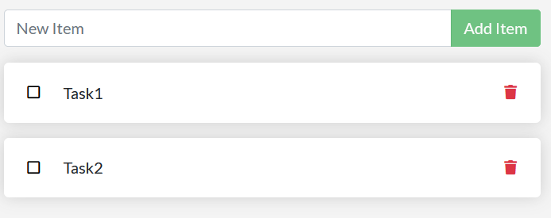

# Erstellen einer ToDo-Applikation mit Docker

## Anleitung

### Klonen des Repositories

- Gehe auf [docker-nodejs-sample](https://github.com/ICT-BLJ/docker-nodejs-sample) und erstelle eine Fork
- Kopiere den ```SSH``` oder ```HTTPS``` link unter "Code"
- Öffne die Kommandozeile (cmd)
- Klone dann die Repository lokal auf dein Gerät mit ```git clone [link]```

Du hast jetzt deine GitHub-Repository lokal auf dein Gerät kopiert.

### Docker-Konfiguration und -Installation

- Installiere [Docker Desktop](https://www.docker.com/products/docker-desktop/) (achte auf die richtige Version)

 Achte darauf, dass du die richtige Version für dein Gerät herunterlädst.

### Installation der notwendigen Pakete

- Starte Docker-Desktop auf deinem Gerät
- Öffne die Kommandozeile in deinem Projekt und gebe ```docker init``` ein.

Gib die folgenden Sachen ein:

```text
? What application platform does your project use? Node
? What version of Node do you want to use? 18.0.0
? Which package manager do you want to use? npm
? What command do you want to use to start the app: node src/index.js
? What port does your server listen on? 3000
```

### Applikation in einem Docker-Container starten

- Mit dem Befehl ```docker compose up --build``` startet man dann das
Programm in dem erstellten Docker-Container.
- Öffne einen beliebigen Browser und gebe [localhost:3000](http://localhost:3000/) ein.

</br>

Wenn alles funktioniert hat sollte die Website so aussehen:


- Mit ```docker compose down``` hält man das Programm wieder an.

</br>

Viel Spass beim Ausprobieren!
